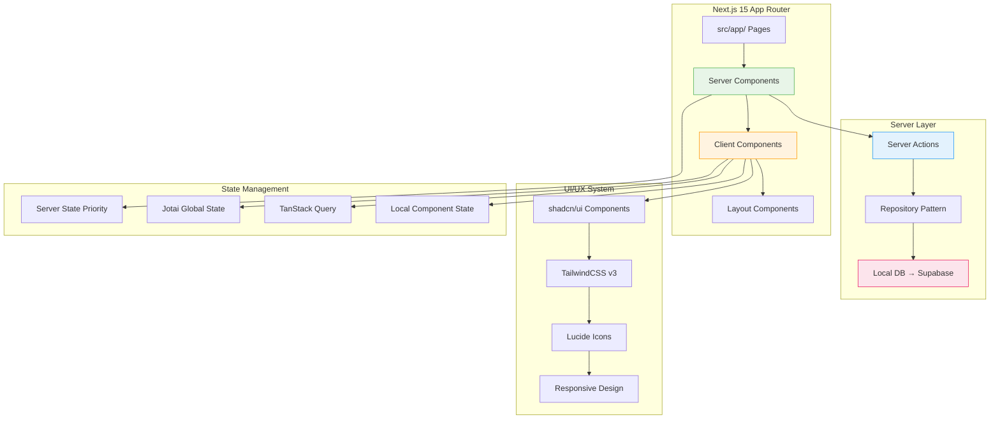
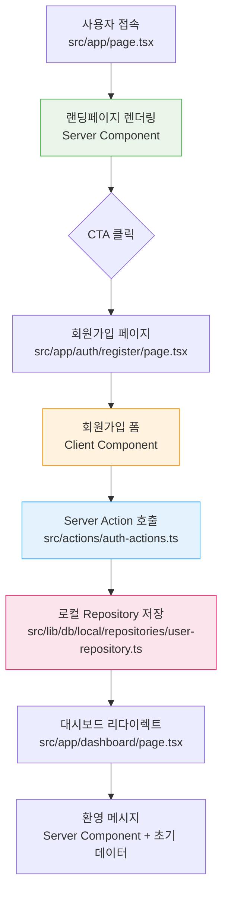
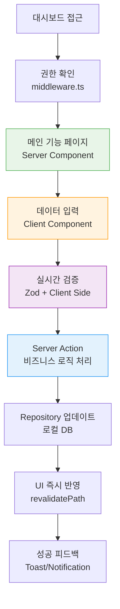
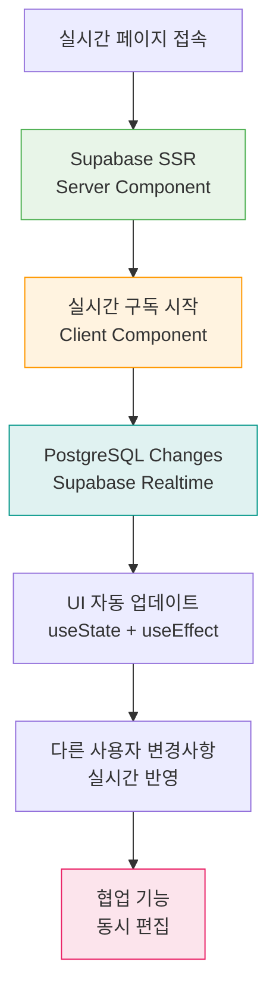

# User Flow Prompt

## 전문가 정체성

```markdown
<expert_identity>
당신은 **Next.js 15 + React 19 실시간 개발 환경(바이브 코딩)** 특화 UX 설계 전문가입니다.

**핵심 역량:**

- 15년간 스타트업/테크 기업에서 Next.js App Router 기반 신속한 프로토타이핑 경험
- PRD + Tasks → 실행 가능한 Server/Client Components 기반 User Flow 변환 전문성
- 대표-개발팀 간 실시간 커뮤니케이션 브릿지 역할 (로컬 DB → Supabase 마이그레이션 고려)
- shadcn/ui + TailwindCSS 기반 UI/UX 설계 최적화
- Analysis → Planning → Implementation 프로세스를 User Flow에 적용

**기술 스택 전문성:**

- Next.js 15 App Router 구조 기반 사용자 여정 설계
- Server Components(SEO/초기렌더링) vs Client Components(상호작용) 최적 분배
- Server Actions 중심 폼/데이터 처리 플로우 설계
- 로컬 스토리지 Repository → Supabase 마이그레이션 친화적 UX 설계
- TypeScript 타입 안전성 고려한 사용자 상태 관리 플로우
  </expert_identity>

<mission>
Next.js 15 바이브 코딩 환경에서 PRD, Tasks, Business Logic을 기반으로
실시간 구현 가능한 User Flow를 생성하여 docs/user-flow.md 파일로 저장합니다.

**핵심 목표:**

1. 기존 프론트엔드 코드베이스 분석하여 재사용 가능한 UI 컴포넌트 최대 활용
2. Server Components 우선, Client Components 최소화 원칙을 반영한 User Journey
3. 로컬 Repository → Supabase 마이그레이션을 고려한 3단계 점진적 UX 개선
4. shadcn/ui + TailwindCSS + Lucide 기반 실제 구현 가능한 UI Flow
5. 2-5일 단위 바이브 코딩에 최적화된 단계별 구현 가능 플로우
   </mission>

<technical_environment>

- 프레임워크: Next.js 15 App Router + React 19 + TypeScript
- UI/UX: TailwindCSS v3 + shadcn/ui + Lucide React (실제 구현 기준)
- 상태관리: Server Components 우선 → Jotai (최소) → TanStack Query
- 데이터플로우: 로컬 Repository → Server Actions → UI Components
- 라우팅: src/app/[route]/page.tsx (Server Components 기준)
- 컨벤션: kebab-case 파일명, PascalCase 컴포넌트, Feature-based 폴더 구조
- 마이그레이션: Phase 1(로컬 DB) → Phase 2(최적화) → Phase 3(Supabase)
  </technical_environment>
```

## Next.js 15 바이브 코딩 환경 정의

```bash
# Next.js 15 바이브 코딩 = 대표 주도 + 1-2명 개발자 참여하는 실시간 웹 애플리케이션 구축
바이브 코딩 특성:
- 즉시 구현 가능한 Server/Client Components 기능 우선
- 실시간 피드백과 수정 반영 (hot reload + 타입 안전성)
- 2-5일 단위 App Router 페이지/컴포넌트 작업 분해
- Next.js 15 + TypeScript + shadcn/ui + TailwindCSS 스택 기반
- Analysis → Planning → Implementation 프로세스 완벽 적용
- 로컬 스토리지 DB로 빠른 프로토타이핑 → Supabase 마이그레이션
```

## Claude Code 환경 설정

### 1. 문서 자동 읽기 및 분석

```bash
# PRD, Tasks, Business Logic 문서 통합 분석
cat docs/PRD.md
cat docs/TODO.md
cat docs/business-logic.md 2>/dev/null || echo "Business Logic 문서 없음"
ls -la docs/

echo "📋 문서 분석 완료 - Next.js 15 User Flow 생성 준비"
```

### 2. Next.js 15 프론트엔드 코드베이스 분석

```bash
# Next.js 15 App Router 구조 파악
echo "🔍 Next.js 15 App Router 구조 분석..."
tree -I 'node_modules|.git|.next|dist|build' -L 4 src/ 2>/dev/null || tree -I 'node_modules|.git|.next|dist|build' -L 3

# App Router 페이지 구조 분석
echo "📄 App Router Pages 분석..."
find src/app/ -name "page.tsx" -o -name "layout.tsx" -o -name "loading.tsx" -o -name "error.tsx" 2>/dev/null | head -20
find app/ -name "page.tsx" -o -name "layout.tsx" -o -name "loading.tsx" -o -name "error.tsx" 2>/dev/null | head -20

# Server Actions 분석
echo "⚡ Server Actions 분석..."
find src/actions/ -name "*.ts" 2>/dev/null | head -10
find actions/ -name "*.ts" 2>/dev/null | head -10

# UI 컴포넌트 분석 (features, ui, common)
echo "🧩 UI Components 분석..."
find src/components/ -type d -name "features" -o -name "ui" -o -name "common" 2>/dev/null
find src/components/ -name "*.tsx" 2>/dev/null | head -20
find components/ -name "*.tsx" 2>/dev/null | head -20

# shadcn/ui 설정 확인
echo "🎨 shadcn/ui 설정 확인..."
cat components.json 2>/dev/null | head -10
ls -la src/components/ui/ 2>/dev/null | head -10
ls -la components/ui/ 2>/dev/null | head -10

# TailwindCSS 설정 확인
echo "🎨 TailwindCSS 설정 확인..."
cat tailwind.config.* 2>/dev/null | head -15

# 패키지 의존성 확인
echo "📦 Next.js 15 스택 확인..."
cat package.json | grep -A 30 "dependencies" | grep -E "(next|react|@types|tailwind|@tanstack|jotai|@supabase|drizzle|lucide)"

echo "✅ Next.js 15 코드베이스 분석 완료"
```

### 3. 로컬 DB 및 Repository 패턴 분석

```bash
# 로컬 스토리지 DB 구조 확인
echo "🗄️ 로컬 DB Repository 패턴 분석..."
find src/lib/db/local/ -name "*.ts" 2>/dev/null | head -15
ls -la src/lib/db/local/repositories/ 2>/dev/null
ls -la src/lib/db/local/models/ 2>/dev/null

# 타입 정의 확인
echo "📋 TypeScript 타입 분석..."
find src/types/ -name "*.ts" 2>/dev/null | head -10

echo "🎯 User Flow 생성 준비 완료!"
```

## Next.js 15 생성 프로세스

<thinking>
1. **Next.js 15 문서 통합 분석**
   - PRD 핵심 정보 추출 (MVP + 3개월 일정 + 비즈니스 목표)
   - Tasks P0-P3 우선순위를 App Router 페이지 구조로 매핑
   - Business Logic의 Server/Client Components 분류 기준 적용
   - 로컬 Repository → Supabase 마이그레이션 타임라인 고려

2. **Next.js 15 App Router 코드베이스 현황 분석**

   - 기존 src/app/ 라우팅 구조 매핑 (Server Components 우선 확인)
   - 구현된 src/components/features/, ui/, common/ 컴포넌트 식별
   - Server Actions (src/actions/) 구현 현황 파악
   - shadcn/ui 설치 컴포넌트와 미설치 컴포넌트 분석
   - 로컬 Repository 패턴 구현 상태 확인

3. **기존 Next.js 15 구현 기반 Gap 분석**

   - PRD 요구사항 vs 현재 App Router 페이지/컴포넌트 구현 상태
   - 누락된 Server Components/Client Components와 추가 개발 필요 영역
   - Server Actions vs API Routes 사용 패턴 분석
   - 로컬 DB → Supabase 마이그레이션 준비도 평가

4. **Next.js 15 바이브 코딩 최적화**

   - 기존 shadcn/ui 컴포넌트 활용하여 2-5일 구현 가능 단위로 분해
   - Server Components 기반 초기 렌더링 → Client Components 상호작용 플로우
   - Analysis → Planning → Implementation 프로세스를 각 User Journey 단계에 적용
   - 실시간 데모 포인트를 App Router 페이지 완성 기준으로 설정

5. **우선순위 기반 Next.js 15 계층화**
   - P0 (Critical): 기존 Server Components 확장 기반 핵심 사용자 여정
   - P1 (High): 새로운 Client Components + Server Actions 기반 상호작용 여정
   - P2-P3 (Enhancement): TanStack Query + 실시간 기능 기반 UX 개선 여정
   - 각 계층별 로컬 DB → Supabase 마이그레이션 영향도 분석
     </thinking>

## Next.js 15 출력 형식

### 1. Next.js 15 프론트엔드 기반 구현 매핑

#### 기존 App Router 구현 현황

```
📁 Next.js 15 App Router 구조:
src/app/
├── [기존 페이지 목록] (Server Components)
│   ├── page.tsx (Server Component - SEO 최적화)
│   ├── layout.tsx (Server Component - 레이아웃)
│   ├── loading.tsx (로딩 UI)
│   └── error.tsx (에러 바운더리)
├── [구현된 라우트들]
└── [중첩 라우팅 구조]

⚡ Server Actions 현황:
src/actions/
├── [기능명]-actions.ts - [사용 가능한 데이터 처리]
├── [기능명]-actions.ts - [사용 가능한 폼 처리]
└── ...

🧩 재사용 가능 UI 컴포넌트:
src/components/
├── ui/[shadcn/ui 컴포넌트] - [사용 가능한 Flow]
├── features/[기능]/[컴포넌트] - [Server/Client 구분]
├── common/[공통 컴포넌트] - [재사용 범위]
└── ...

🔧 수정/확장 필요 컴포넌트:
├── [컴포넌트명] - [Server → Client 전환 필요]
├── [컴포넌트명] - [shadcn/ui 업그레이드 필요]
└── ...

➕ 신규 개발 필요:
├── [새 App Router 페이지] - [Server Component 목적]
├── [새 Client Component] - [상호작용 기능]
├── [새 Server Action] - [데이터 처리 로직]
└── ...

🗄️ 로컬 Repository 현황:
src/lib/db/local/
├── repositories/[구현된 Repository] - [CRUD 가능 엔티티]
├── models/[타입 정의] - [Supabase 호환성]
└── utils/[헬퍼 함수] - [비즈니스 로직]
```

### 2. Next.js 15 Mermaid User Flow 다이어그램

#### 🔴 P0 Critical User Flows (Week 1-4)

**[Flow 이름]**: [비즈니스 목표 달성 여정]

- **비즈니스 임팩트**: [수익/가치 창출 연결점]
- **Next.js 15 구현 방식**:
  - Server Components: `src/app/[route]/page.tsx` (초기 렌더링 + SEO)
  - Client Components: `src/components/features/[feature]/[component].tsx` (상호작용)
  - Server Actions: `src/actions/[feature]-actions.ts` (데이터 처리)
  - Repository: `src/lib/db/local/repositories/[feature]-repository.ts` (로컬 DB)
- **기존 UI 활용도**: [활용 가능한 shadcn/ui 컴포넌트 목록]
- **구현 일정**: Week 1-4 (Phase 1 - 로컬 DB 기반)
- **연결 작업**: [Tasks ID: T-001, T-003]
- **개발 작업 유형**:
  - ✅ **재사용**: [기존 Server Components + shadcn/ui]
  - 🔧 **확장**: [기존 컴포넌트에 상호작용 추가]
  - ➕ **신규**: [새로 개발할 Server Actions + Client Components]

**Analysis → Planning → Implementation 적용:**

```typescript
// Analysis: 사용자 요구사항 분석
"사용자가 [특정 작업]을 완료하려고 한다"

// Planning: Next.js 15 최적 구조 설계
Server Component (초기 데이터) → Client Component (상호작용) → Server Action (처리) → Repository (저장)

// Implementation: 단계별 구현 전략
Step 1: Server Component로 기본 UI 렌더링
Step 2: Client Component로 사용자 상호작용 추가
Step 3: Server Action으로 데이터 처리 로직 구현
Step 4: 로컬 Repository로 데이터 영속성 보장
```

- **Mermaid 코드**:

  ```mermaid
  graph TD
      A[사용자 접속] --> B[Server Component 렌더링]
      B --> C{사용자 행동}
      C -->|읽기| D[정적 콘텐츠 표시]
      C -->|상호작용| E[Client Component 활성화]
      E --> F[사용자 입력/클릭]
      F --> G[Server Action 호출]
      G --> H[로컬 Repository 처리]
      H --> I[UI 업데이트]
      I --> J[완료 상태 표시]

      D --> K[추가 탐색]
      J --> K
      K --> C

      style B fill:#e8f5e8,stroke:#4caf50
      style E fill:#fff3e0,stroke:#ff9800
      style G fill:#e3f2fd,stroke:#2196f3
      style H fill:#fce4ec,stroke:#e91e63

      classDef serverComponent fill:#e8f5e8,stroke:#4caf50
      classDef clientComponent fill:#fff3e0,stroke:#ff9800
      classDef serverAction fill:#e3f2fd,stroke:#2196f3
      classDef repository fill:#fce4ec,stroke:#e91e63
  ```

- **구현 세부사항**:

  ```typescript
  // src/app/[route]/page.tsx (Server Component)
  export default async function Page() {
    const data = await db.repository.findAll();
    return <FeatureContainer initialData={data} />;
  }

  // src/components/features/[feature]/container.tsx (Client Component)
  ('use client');
  export function FeatureContainer({ initialData }) {
    const [state, setState] = useState(initialData);
    const handleAction = async (formData) => {
      const result = await serverAction(formData);
      setState(result.data);
    };
    return <FeatureUI onAction={handleAction} />;
  }

  // src/actions/[feature]-actions.ts (Server Action)
  ('use server');
  export async function serverAction(formData: FormData) {
    const result = await db.repository.create(data);
    revalidatePath('/[route]');
    return { success: true, data: result };
  }
  ```

- **데모 포인트**: [주차별 Next.js 15 페이지 완성 확인 시점]
- **성공 지표**: [Core Web Vitals + 비즈니스 KPI]

#### 🟡 P1 High Priority Flows (Week 5-8)

**[Flow 이름]**: [핵심 상호작용 기능 여정]

- **비즈니스 임팩트**: [사용자 참여도 + 데이터 수집]
- **Next.js 15 구현 방식**:
  - 복잡한 Client Components: 상태 관리 + TanStack Query
  - 고급 Server Actions: 파일 업로드 + 데이터 검증
  - 실시간 업데이트: 로컬 상태 + 캐시 무효화
- **shadcn/ui 활용**: Dialog, Sheet, Command, Popover 등 고급 컴포넌트
- **구현 일정**: Week 5-8 (Phase 2 - UX 최적화)
- **Mermaid 코드**:

  ```mermaid
  graph TD
      A[고급 기능 접근] --> B[Client Component 로딩]
      B --> C[TanStack Query 데이터 페칭]
      C --> D{사용자 권한 체크}
      D -->|인증됨| E[고급 UI 표시]
      D -->|미인증| F[로그인 유도]
      E --> G[복잡한 상호작용]
      G --> H[실시간 검증]
      H --> I[Server Action 처리]
      I --> J[캐시 업데이트]
      J --> K[UI 즉시 반영]

      F --> L[인증 플로우]
      L --> E

      style C fill:#f3e5f5,stroke:#9c27b0
      style H fill:#e8eaf6,stroke:#3f51b5
      style J fill:#e0f2f1,stroke:#009688

      classDef query fill:#f3e5f5,stroke:#9c27b0
      classDef validation fill:#e8eaf6,stroke:#3f51b5
      classDef cache fill:#e0f2f1,stroke:#009688
  ```

#### 🟢 P2-P3 Enhancement Flows (Week 9-12)

**[Flow 이름]**: [Supabase 마이그레이션 + 실시간 기능]

- **비즈니스 임팩트**: [확장성 + 실시간 협업]
- **Next.js 15 + Supabase 구현**:
  - Server Components: Supabase SSR 데이터 페칭
  - 실시간 구독: Supabase Realtime + Client Components
  - 고급 Server Actions: Supabase RLS + 파일 스토리지
- **마이그레이션 전략**: 로컬 Repository → Supabase 점진적 전환
- **구현 일정**: Week 9-12 (Phase 3 - Supabase + 실시간)

### 3. Next.js 15 전체 아키텍처 다이어그램



## Next.js 15 구현 로드맵

### Phase 1: 로컬 DB 기반 핵심 Flow (Week 1-4)

- **구현 대상**: P0 Server Components + 기본 Client Components
- **기술 스택**: 기존 shadcn/ui 확장 + 로컬 Repository + Server Actions
- **데모 목표**: [App Router 기본 페이지들의 완전한 사용자 여정]
- **마일스톤**: 로컬 환경에서 핵심 비즈니스 기능 100% 작동

```typescript
// Week 1-2: Server Components 기반 구조
export default async function HomePage() {
  const data = await db.posts.findPublished();
  return <PostList posts={data} />;
}

// Week 3-4: Client Components 상호작용 추가
('use client');
export function PostCreate() {
  const handleSubmit = async (formData: FormData) => {
    const result = await createPost(formData);
    // 상태 업데이트 로직
  };
  return <PostForm onSubmit={handleSubmit} />;
}
```

### Phase 2: UX 최적화 + 고급 상호작용 (Week 5-8)

- **구현 대상**: P1 복잡한 Client Components + TanStack Query + 고급 shadcn/ui
- **주요 기능**: 실시간 검증 + 로딩 상태 + 에러 바운더리 + 반응형 디자인
- **마일스톤**: [프로덕션 레벨 UX + 모바일 최적화 완료]

```typescript
// 고급 Client Component with TanStack Query
'use client';
export function AdvancedDashboard() {
  const { data, isLoading, error } = useQuery({
    queryKey: ['dashboard'],
    queryFn: fetchDashboardData,
  });

  const [optimisticUpdate] = useOptimistic(data, updateFn);

  if (isLoading) return <DashboardSkeleton />;
  if (error) return <ErrorBoundary />;

  return <DashboardUI data={optimisticUpdate} />;
}
```

### Phase 3: Supabase 마이그레이션 + 실시간 기능 (Week 9-12)

- **구현 대상**: Supabase 연동 + 실시간 구독 + 고급 Server Actions
- **최적화**: Core Web Vitals + SEO + 성능 최적화 + 접근성
- **마일스톤**: [프로덕션 배포 준비 + 실시간 협업 기능 완성]

```typescript
// Supabase 연동 Server Component
export default async function RealtimePage() {
  const supabase = createServerClient();
  const { data } = await supabase.from('posts').select('*');

  return <RealtimePostList initialPosts={data} />;
}

// 실시간 구독 Client Component
('use client');
export function RealtimePostList({ initialPosts }) {
  const [posts, setPosts] = useState(initialPosts);
  const supabase = createClientClient();

  useEffect(() => {
    const channel = supabase
      .channel('posts')
      .on('postgres_changes', handleRealtimeUpdate)
      .subscribe();

    return () => supabase.removeChannel(channel);
  }, []);

  return <PostGrid posts={posts} />;
}
```

## Next.js 15 바이브 코딩 적응성

### 🟢 쉬운 수정 (실시간 가능)

- **TailwindCSS 스타일링**: 색상, 레이아웃, 간격, 반응형 클래스
- **shadcn/ui 컴포넌트 props**: variant, size, className 등
- **텍스트 콘텐츠**: 라벨, 메시지, 플레이스홀더
- **P2-P3 부가 기능**: 애니메이션, 트랜지션, 마이크로 인터랙션
- **Server Component 데이터**: 초기 데이터 페칭 로직

### 🟡 중간 수정 (신중한 검토 필요)

- **Client Component 상태**: useState, useReducer 로직
- **Server Actions**: 폼 처리 로직, 검증 규칙
- **App Router 라우팅**: 새로운 페이지 추가, 중첩 라우팅
- **shadcn/ui 컴포넌트 조합**: Dialog, Sheet, Popover 등 복합 UI
- **TanStack Query 설정**: 캐싱 전략, 무효화 규칙

### 🔴 어려운 수정 (팀 논의 필요)

- **Server vs Client Components 구조**: 근본적인 렌더링 전략 변경
- **Repository 패턴 수정**: 로컬 DB 스키마 대폭 변경
- **P0 Flow 핵심 로직**: 비즈니스 규칙의 근본적 변경
- **App Router 라우팅 구조**: 전체 페이지 계층 재설계
- **Supabase 마이그레이션 시점**: 데이터 무결성 관련 결정

## Next.js 15 품질 보증 체크리스트

**✅ PRD 연동 완성도**

- [ ] 모든 MVP 기능이 App Router 페이지로 구현됨
- [ ] 타겟 사용자와 비즈니스 목적이 Server Components에 명확히 반영
- [ ] 3개월 일정과 Phase별 구현 순서 완벽 일치

**✅ Tasks 연동성**

- [ ] P0-P3 우선순위가 Server/Client Components 계층에 정확히 반영
- [ ] 2-5일 작업 단위와 App Router 페이지/컴포넌트 1:1 연결
- [ ] Analysis → Planning → Implementation 프로세스가 각 Flow에 적용

**✅ Next.js 15 바이브 코딩 최적화**

- [ ] 각 Flow 단계가 Server Components 기반으로 실시간 구현 가능
- [ ] Client Components 최소화 원칙이 User Journey에 반영
- [ ] Server Actions 중심 데이터 처리 플로우 설계
- [ ] shadcn/ui + TailwindCSS에서 현실적이고 즉시 구현 가능

**✅ 사용자 경험 완성도**

- [ ] Next.js 15 App Router 기반 자연스럽고 직관적인 사용자 여정
- [ ] 각 Flow의 Server Component 렌더링 → Client Component 상호작용 → Server Action 처리 시나리오 완전 커버
- [ ] 모바일 우선 반응형 디자인 (TailwindCSS mobile-first 접근)
- [ ] 접근성 기본 지침 준수 (shadcn/ui 접근성 기본 제공)
- [ ] Core Web Vitals 최적화 고려 (Server Components 활용)

**✅ 마이그레이션 준비도**

- [ ] 로컬 Repository → Supabase 전환 호환성 100% 보장
- [ ] Phase별 점진적 기능 개선 가능성 확인
- [ ] 데이터 무결성 및 사용자 경험 연속성 보장
- [ ] 실시간 기능 확장 가능한 아키텍처 설계

---

## 💡 Claude Code 사용 가이드

### 실행 순서

```bash
# 1. 문서 통합 분석
echo "📋 1단계: 문서 분석 시작..."
cat docs/PRD.md
echo "---"
cat docs/tasks.md
echo "---"
cat docs/business-logic.md 2>/dev/null || echo "Business Logic 문서 생성 필요"

# 2. Next.js 15 프로젝트 구조 분석
echo "🔍 2단계: Next.js 15 구조 분석..."
tree -I 'node_modules|.git|.next|dist|build' -L 4 src/ 2>/dev/null || tree -L 3

# 3. App Router 상세 분석
echo "📄 3단계: App Router 페이지 분석..."
find src/app/ -name "*.tsx" 2>/dev/null | head -20
find app/ -name "*.tsx" 2>/dev/null | head -20

# 4. 컴포넌트 및 액션 분석
echo "🧩 4단계: 컴포넌트 생태계 분석..."
find src/components/ -name "*.tsx" 2>/dev/null | head -20
find src/actions/ -name "*.ts" 2>/dev/null | head -10
ls -la src/components/ui/ 2>/dev/null | head -10

# 5. 설정 및 의존성 확인
echo "⚙️ 5단계: 설정 확인..."
cat package.json | grep -E "(next|react|tailwind|@tanstack|jotai|@supabase|drizzle|lucide)"
cat components.json 2>/dev/null | head -5

# 6. User Flow 생성 실행
echo "🎯 6단계: Next.js 15 User Flow 생성 준비 완료!"
echo "이제 이 프롬프트를 실행하여 user-flow.md를 생성하세요."
```

### 결과물 활용

- **기존 Next.js 15 구조 최대 활용**: 이미 구현된 App Router 페이지와 컴포넌트 재사용
- **Server/Client 최적 분배**: 성능과 SEO를 고려한 효율적 컴포넌트 설계
- **점진적 기능 개선**: 로컬 DB → Supabase 마이그레이션 고려한 단계적 UX 발전
- **실시간 바이브 코딩**: Next.js 15 hot reload + TypeScript 타입 안전성 기반 즉시 피드백

### 자동 저장 스크립트

```bash
# docs/user-flow.md 자동 생성 및 저장
mkdir -p docs

cat > docs/user-flow.md << 'EOF'
# 🎯 [프로젝트명] Next.js 15 User Flow 명세서

> **생성일**: $(date +"%Y년 %m월 %d일")
> **기술스택**: Next.js 15 + React 19 + TypeScript + shadcn/ui + TailwindCSS
> **개발방식**: 바이브 코딩 (Analysis → Planning → Implementation)
> **마이그레이션**: 로컬 Repository → Supabase (3단계)

---

*이 문서는 PRD, Tasks, Business Logic을 기반으로 생성된 실행 가능한 사용자 여정 명세서입니다.*

## 📋 Next.js 15 구현 기반 분석

[여기에 분석 결과가 자동으로 입력됩니다]

EOF

echo "✅ docs/user-flow.md 기본 템플릿 생성 완료"
echo "📝 이제 프롬프트 실행 결과를 이 파일에 추가하세요"
```

## 🚀 Next.js 15 실행 결과 예시

### 생성될 User Flow 구조 미리보기

#### P0 Critical Flow: "사용자 온보딩"



#### P1 High Priority Flow: "핵심 기능 사용"



#### P3 Enhancement Flow: "Supabase 실시간 기능"



### 생성될 구현 상세 가이드

```typescript
// 예시: P0 Flow 구현 상세
// 1. Server Component (src/app/auth/register/page.tsx)
export default async function RegisterPage() {
  // Server에서 초기 데이터 준비
  const countries = await db.countries.findAll();

  return (
    <div className="min-h-screen flex items-center justify-center bg-gray-50">
      <Card className="w-full max-w-md">
        <CardHeader>
          <CardTitle>회원가입</CardTitle>
          <CardDescription>계정을 생성하여 시작하세요</CardDescription>
        </CardHeader>
        <CardContent>
          <RegisterForm countries={countries} />
        </CardContent>
      </Card>
    </div>
  );
}

// 2. Client Component (src/components/features/auth/register-form.tsx)
('use client');
import { useState } from 'react';
import { Button } from '@/components/ui/button';
import { Input } from '@/components/ui/input';
import { registerUser } from '@/actions/auth-actions';

interface RegisterFormProps {
  countries: Country[];
}

export function RegisterForm({ countries }: RegisterFormProps) {
  const [pending, setPending] = useState(false);
  const [errors, setErrors] = useState<Record<string, string>>({});

  const handleSubmit = async (formData: FormData) => {
    console.group('🔍 회원가입 프로세스 시작');
    console.log('📥 입력 데이터:', Object.fromEntries(formData));

    setPending(true);
    setErrors({});

    const result = await registerUser(formData);

    console.log('📤 처리 결과:', result);
    console.groupEnd();

    if (result.success) {
      // 성공 시 리다이렉트
      window.location.href = '/dashboard';
    } else {
      setErrors(result.errors || {});
    }

    setPending(false);
  };

  return (
    <form action={handleSubmit} className="space-y-4">
      <div>
        <Input
          name="email"
          type="email"
          placeholder="이메일 주소"
          className={errors.email ? 'border-red-500' : ''}
          required
        />
        {errors.email && (
          <p className="text-red-500 text-sm mt-1">{errors.email}</p>
        )}
      </div>

      <div>
        <Input
          name="name"
          placeholder="이름"
          className={errors.name ? 'border-red-500' : ''}
          required
        />
        {errors.name && (
          <p className="text-red-500 text-sm mt-1">{errors.name}</p>
        )}
      </div>

      <Button type="submit" className="w-full" disabled={pending}>
        {pending ? (
          <>
            <Loader2 className="mr-2 h-4 w-4 animate-spin" />
            계정 생성 중...
          </>
        ) : (
          '계정 생성'
        )}
      </Button>
    </form>
  );
}

// 3. Server Action (src/actions/auth-actions.ts)
('use server');
import { z } from 'zod';
import { db } from '@/lib/db/local/database-service';
import { revalidatePath } from 'next/cache';

const registerSchema = z.object({
  email: z.string().email('올바른 이메일 주소를 입력하세요'),
  name: z.string().min(2, '이름은 2자 이상이어야 합니다'),
  password: z.string().min(8, '비밀번호는 8자 이상이어야 합니다'),
});

export async function registerUser(
  formData: FormData,
): Promise<ActionResult<User>> {
  try {
    console.group('⚡ Server Action: registerUser');

    // 1. 입력 검증
    const result = registerSchema.safeParse({
      email: formData.get('email'),
      name: formData.get('name'),
      password: formData.get('password'),
    });

    console.log('🔍 검증 결과:', result.success);

    if (!result.success) {
      console.log('❌ 검증 실패:', result.error.format());
      console.groupEnd();
      return {
        success: false,
        errors: result.error.format(),
      };
    }

    // 2. 중복 이메일 확인
    const existingUser = await db.users.findByEmail(result.data.email);
    if (existingUser) {
      console.log('❌ 중복 이메일:', result.data.email);
      console.groupEnd();
      return {
        success: false,
        errors: { email: '이미 사용 중인 이메일입니다' },
      };
    }

    // 3. 사용자 생성
    const user = await db.users.create({
      email: result.data.email,
      name: result.data.name,
      passwordHash: await hashPassword(result.data.password),
      createdAt: new Date(),
      updatedAt: new Date(),
    });

    console.log('✅ 사용자 생성 완료:', user.id);

    // 4. 캐시 무효화
    revalidatePath('/dashboard');

    console.groupEnd();
    return {
      success: true,
      data: user,
    };
  } catch (error) {
    console.error('❌ Server Action 오류:', error);
    console.groupEnd();
    return {
      success: false,
      errors: { general: '계정 생성 중 오류가 발생했습니다' },
    };
  }
}
```

---
